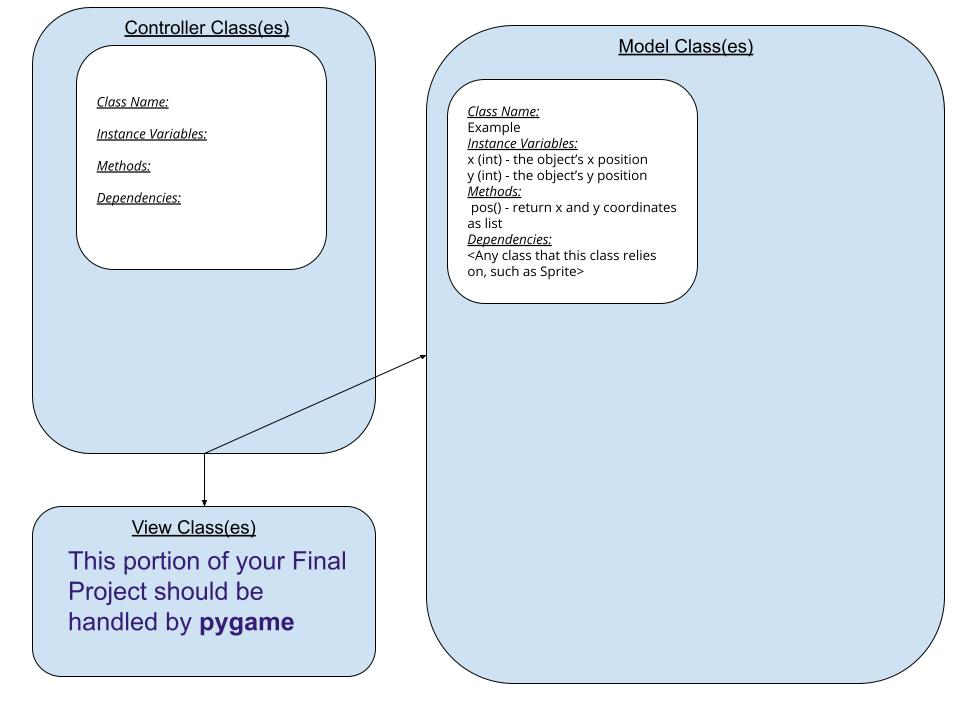

:warning: Everything between << >> needs to be replaced (remove << >> after replacing)
# CS110 Project Proposal
# << Super 8^11/3 >>
## CS 110 Final Project
### Spring, 2022
### [Assignment Description](https://docs.google.com/document/d/1H4R6yLL7som1lglyXWZ04RvTp_RvRFCCBn6sqv-82ps/edit#)

<< [repl](#) >>

<< [link to demo presentation slides](#) >>

### Team: << Super 8 >>
#### Colin Orr, Seamus Madden, Matthew An

***

## Project Description *(Software Lead)*

This project is a development of the game, 2048. The player uses the 4-control panel (up, down, right, left) to move the blocks across the board. When two like blocks are merged, they merge to create a block of their sum; naturally, the blocks are iterations of 2^n. The game ends in failure if the screen is filled and there are no possible merges. The game ends in success if a 2048 block is achieved. 

***    

## User Interface Design *(Front End Specialist)*

* << A wireframe or drawing of the user interface concept along with a short description of the interface. You should have one for each screen in your program. >>
    * For example, if your program has a start screen, game screen, and game over screen, you should include a wireframe / screenshot / drawing of each one and a short description of the components
* << You should also have a screenshot of each screen for your final GUI >>

***        

## Program Design *(Backend Specialist)*

* Non-Standard libraries
    * << You should have a list of any additional libraries or modules used (pygame, request) beyond non-standard python. >>
    * For each additional module you should include
        * url for the module documentation
        * a short description of the module
* Class Interface Design
    * << A simple drawing that shows the class relationships in your code (see below for an example). >>
        * 
    * This does not need to be overly detailed, but should show how your code fits into the Model/View/Controller paradigm.
* Classes
    * << You should have a list of each of your classes with a description. >>
* class move

def moveLeft:

def moveRight:

## Project Structure *(Software Lead)*

The Project is broken down into the following file structure:

* main.py
* src
    * <all of your python files should go here>
* assets
    * <all of your media, i.e. images, font files, etc, should go here)
* etc
    * <This is a catch all folder for things that are not part of your project, but you want to keep with your project. Your demo video should go here.>

***

## Tasks and Responsibilities *(Software Lead)*

   * You must outline the team member roles and who was responsible for each class/method, both individual and collaborative.

### Software Lead - << Seamus Madden >>

<< Worked as integration specialist by... >>

### Front End Specialist - << Matthew An >>

<< Front-end lead conducted significant research on... >>

### Back End Specialist - << Colin Orr >>

<< The back end specialist... >>

## Testing *(Software Lead)*

* << Describe your testing strategy for your project. >>
    * << Example >>

## ATP

| Step                  | Procedure     | Expected Results  | Actual Results |
| ----------------------|:-------------:| -----------------:| -------------- |
|  1  | Click Up Arrow  | Merges or Moves Tiles Up |                 |
|  2  | Click Down Arrow  | Merges or Moves Tiles Down |                 |
|  3  | Click Right Arrow  | Merges or Moves Tiles Right |                 |
|  4  | Click Left Arrow  | Merges or Moves Tiles Left |                   |
|  5  | Merging tiles  | Tiles merge to create new tile of sum of two like tiles | |
|  6  |  New tile generation | Creates a new tile every time there is a movement in one of the empty spaces on the grid| |
|  9  | Win screen  | When 2048 is reached, display win screen |  |
|  10  | Game Over Screen  | If no more moves possible then a Game Over |  |